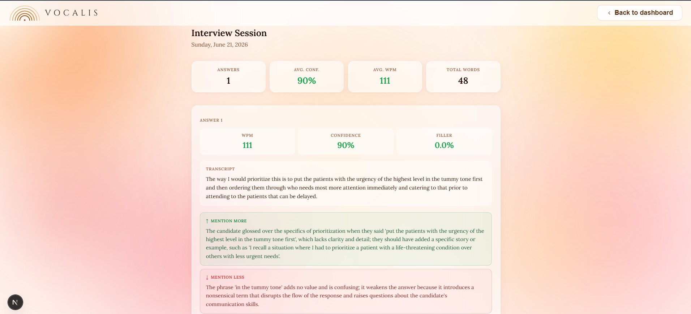

# Vocalis

AI-powered interview coaching app. Record yourself answering interview questions, get instant transcription, and receive detailed feedback on your delivery — pace, filler words, word choice, structure, and more.



---

## Features

- **AI question generation** — generates tailored interview questions based on job title, experience level, and focus areas (behavioral, technical, leadership, etc.)
- **Live audio recording** — in-browser recording with a real-time waveform visualizer and live timer
- **Speech analysis** — measures words per minute, filler word rate, confidence score, and vocabulary diversity
- **Coaching feedback** — LLM-powered breakdown covering:
  - What to expand on
  - What to cut
  - Must-mention points (FAANG-style)
  - STAR structure guidance
  - Speaking pace advice with WPM benchmarks
  - Word choice and framing rewrites
- **Session history** — every interview is saved and browsable, with per-answer metrics and full feedback
- **Animated background** — warm mesh gradient with mouse parallax and a soft cursor spotlight

---

## Tech Stack

### Frontend
- **Next.js 15** (App Router) + **React 18** + **TypeScript**
- **Web Audio API** + **MediaRecorder API** — live waveform and audio capture
- **Firebase Auth** (client SDK) — Google OAuth and email/password sign-in
- Glassmorphism UI with warm mesh gradient background

### Backend
- **FastAPI** (Python, async) with **uvicorn**
- **SQLAlchemy 2** (async) — ORM with SQLite for development, PostgreSQL for production
- **Firebase Admin SDK** — server-side token verification
- **Groq API**
  - `whisper-large-v3-turbo` — audio transcription
  - `llama-3.3-70b-versatile` — feedback generation
- **slowapi** — rate limiting
- **scikit-learn / numpy** — speech feature extraction

---

## Project Structure

```
vocalis/
├── backend/
│   ├── main.py                  # FastAPI app, lifespan, CORS
│   ├── database.py              # SQLAlchemy models (User, Session, Segment)
│   ├── auth.py                  # Firebase token verification middleware
│   ├── llm_feedback.py          # Groq transcription + LLM coaching feedback
│   ├── speech_features.py       # WPM, filler rate, confidence scoring
│   ├── firebase_admin_setup.py
│   └── routes/
│       ├── analyze.py           # POST /api/analyze — transcribe + analyze audio
│       └── sessions.py          # CRUD for interview sessions and questions
└── frontend/
    ├── app/
    │   ├── page.tsx             # Landing / auth page
    │   ├── dashboard/
    │   │   ├── page.tsx         # Session history dashboard
    │   │   ├── interview/       # Live interview page
    │   │   └── session/[id]/    # Session detail view
    │   └── layout.tsx
    ├── components/
    │   ├── AuthForm.tsx
    │   ├── FeedbackPanel.tsx    # Coaching feedback display
    │   ├── Waveform.tsx         # Live audio waveform
    │   ├── SessionHistory.tsx
    │   └── MeshBackground.tsx   # Animated gradient + cursor effects
    ├── hooks/
    │   ├── useAudioCapture.ts   # Recording, transcription, analysis pipeline
    │   └── useAuth.ts           # Firebase auth state
    └── lib/
        └── api.ts               # Typed API client
```

---

## Getting Started

### Prerequisites

- Node.js 18+
- Python 3.11+
- A [Groq API key](https://console.groq.com)
- A Firebase project with Authentication enabled

### Backend

```bash
cd backend
python -m venv venv
source venv/bin/activate  # Windows: venv\Scripts\activate
pip install -r requirements.txt
```

Create a `.env` file in `backend/`:

```env
GROQ_API_KEY=your_groq_api_key
DATABASE_URL=sqlite+aiosqlite:///./vocalis.db   # or postgresql://...
FIREBASE_CREDENTIALS=path/to/serviceAccountKey.json
ALLOWED_ORIGINS=http://localhost:3000
```

Start the server:

```bash
uvicorn main:app --reload --port 8000
```

### Frontend

```bash
cd frontend
npm install
```

Create a `.env.local` file in `frontend/`:

```env
NEXT_PUBLIC_API_URL=http://localhost:8000
NEXT_PUBLIC_FIREBASE_API_KEY=...
NEXT_PUBLIC_FIREBASE_AUTH_DOMAIN=...
NEXT_PUBLIC_FIREBASE_PROJECT_ID=...
NEXT_PUBLIC_FIREBASE_APP_ID=...
```

Start the dev server:

```bash
npm run dev
```

Open [http://localhost:3000](http://localhost:3000).

---

## How It Works

1. **Sign in** with Google or email/password via Firebase Authentication.
2. On the **interview page**, enter your target job title, experience level, and choose focus areas. Vocalis generates 8 tailored questions using LLaMA 3.3 70B.
3. **Record your answer** — the browser captures audio via `MediaRecorder`. A live waveform and timer are shown while recording.
4. On stop, the audio is sent to the backend where Whisper transcribes it, speech features are extracted (WPM, filler rate, confidence), and the LLM generates structured coaching feedback.
5. **Feedback** appears immediately in a breakdown panel. Move through all questions, then click "Back to dashboard" to save the session.
6. The **dashboard** shows all past sessions. Click any session to review every answer with its transcript, metrics, and full feedback breakdown.

---

## Environment Variables Reference

| Variable | Where | Description |
|---|---|---|
| `GROQ_API_KEY` | backend | Groq API key for Whisper + LLaMA |
| `DATABASE_URL` | backend | SQLAlchemy DB URL (SQLite or PostgreSQL) |
| `FIREBASE_CREDENTIALS` | backend | Path to Firebase service account JSON |
| `ALLOWED_ORIGINS` | backend | Comma-separated allowed CORS origins |
| `NEXT_PUBLIC_API_URL` | frontend | Backend base URL |
| `NEXT_PUBLIC_FIREBASE_*` | frontend | Firebase client config values |
